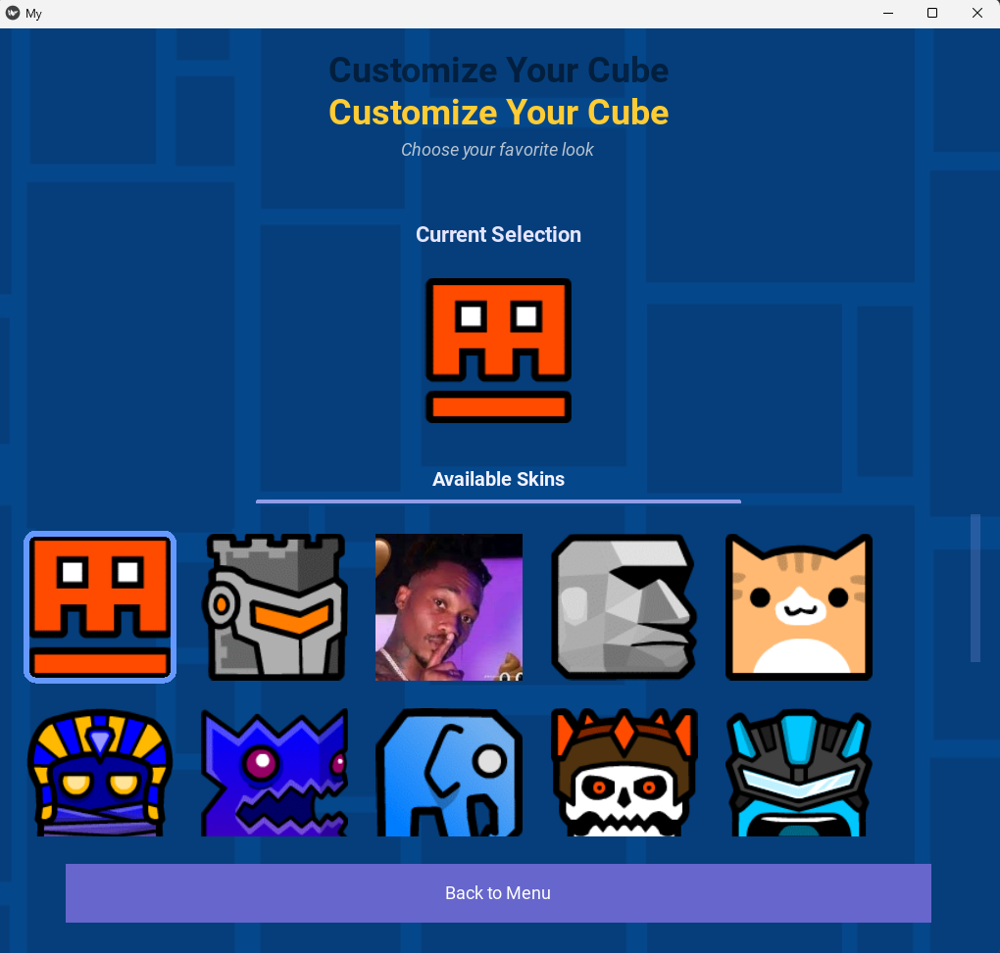

# KivyProject_151_432

## GeoDash Teebarn

GeoDash Teebarn เป็นเกมแนวแพลตฟอร์มแบบเลื่อนด้านข้างที่ได้รับแรงบันดาลใจจาก Geometry Dash โดยผู้เล่นจะต้องควบคุมตัวละครให้กระโดดและหลบหลีกสิ่งกีดขวางต่างๆ เพื่อผ่านด่านที่ท้าทาย

## คุณสมบัติเด่น

- **เกมเพลย์สุดท้าทาย**: ทดสอบความเร็วและความแม่นยำของคุณ
- **ด่านที่หลากหลาย**: มีด่านที่ออกแบบมาอย่างสร้างสรรค์พร้อมอุปสรรคที่แตกต่างกัน
- **เพลงประกอบตื่นเต้น**: เสียงดนตรีที่ช่วยเพิ่มความสนุกในการเล่น

## วิธีการเล่น

1. คลิกเมาส์เพื่อกระโดด
2. หลีกเลี่ยงสิ่งกีดขวางและพยายามไปให้ถึงเส้นชัย
3. เล่นซ้ำเพื่อทำคะแนนให้ดีที่สุด!

## ภาพเกมโดยรวม

### หน้า Home

#### หน้า Home จะมีไว้สําหรับนํ่าทางไปยังหน้าต่างๆได้


### หน้าเลือกสกิน

#### สามารถเลือกสกินที่ชอบได้ตามความต้องการเลย !



### หน้าเลือกด่าน

#### สามารถเลือกด่านที่ต้องการเล่นได้ (เเต่จะต้องผ่านด่านนั้นๆเเล้ว)


### ด่านต่างๆภายในเกม


## การติดตั้งและการใช้งาน

1. ดาวน์โหลดโค้ดจาก GitHub:
   ```bash
   git clone https://github.com/Mhapong/KivyProject_151_432.git
   ```
2. ติดตั้งไลบรารีที่จำเป็น (ถ้ามี)
   ```bash
   pip install -r requirements.txt
   ```
3. รันเกม
   ```bash
   python main.py
   ```

## โครงสร้างของโปรเจค

```
KivyProject_151_432/
│── main.py                # ไฟล์หลักของโปรเจค
│── home_screen.py         # หน้าหลักของเกม
│── stage_selection_screen.py # หน้าสำหรับเลือกด่าน
│── game_screen.py         # หน้าหลักของเกมเพลย์
│── skin_selector_screen.py # หน้าเลือกสกินตัวละคร
│── kv/
│   ├── home.kv           # ไฟล์ KV สำหรับหน้า Home
│   ├── stage_selection.kv # ไฟล์ KV สำหรับเลือกด่าน
│   ├── game.kv           # ไฟล์ KV สำหรับเกมเพลย์
│   ├── skin_selector.kv  # ไฟล์ KV สำหรับเลือกสกิน
│── assets/
│   ├── readme/           # โฟลเดอร์สำหรับภาพประกอบ
│── README.md             # ไฟล์เอกสารอธิบายโปรเจค
```

## คำอธิบายโค้ดหลัก (main.py)

- **import โมดูลหลักของ Kivy**: ใช้ `App` และ `ScreenManager` สำหรับจัดการหน้าต่างของแอปพลิเคชัน
- **import ไฟล์หน้าต่างต่างๆ**: ได้แก่ `HomePage`, `StageSelectionScreen`, `GameScreen`, `SkinSelectorScreen`
- **โหลด KV ไฟล์**: ใช้ `Builder.load_file()` เพื่อโหลด UI จากโฟลเดอร์ `kv`
- **จัดการ Global Keyboard Events**: ใช้ `Window.bind(on_key_down=self.on_key_down)` เพื่อตรวจจับปุ่มที่กดทั่วทั้งแอป

### ฟังก์ชัน `on_key_down()`

```python
def on_key_down(self, window, keycode, scancode, text, modifiers):
    print(f"Global key handler: keycode={keycode}, scancode={scancode}, text={text}")

    if keycode == 27:  # ESC key
        if hasattr(self, 'root') and self.root.current == 'game':
            game_screen = self.root.get_screen('game')
            if hasattr(game_screen, 'toggle_pause'):
                print("Calling toggle_pause")
                game_screen.toggle_pause()
                return True

    if keycode == 32:  # Space key
        if hasattr(self, 'root') and self.root.current == 'game':
            game_screen = self.root.get_screen('game')
            if hasattr(game_screen, 'player') and game_screen.player:
                game_screen.player.jump()
                return True
    return False
```

- ดักจับปุ่ม `ESC` (keycode 27) เพื่อให้เกมสามารถพักชั่วคราวได้
- ดักจับปุ่ม `Space` (keycode 32) เพื่อให้ตัวละครกระโดด

### ฟังก์ชัน `build()`

```python
def build(self):
    sm = ScreenManager()
    sm.add_widget(HomePage(name='home'))
    sm.add_widget(StageSelectionScreen(name='stage_selection'))
    sm.add_widget(GameScreen(name='game'))
    sm.add_widget(SkinSelectorScreen(name='skin_selector'))
    return sm
```

- ใช้ `ScreenManager` เพื่อจัดการการเปลี่ยนหน้า
- เพิ่ม `HomePage`, `StageSelectionScreen`, `GameScreen`, `SkinSelectorScreen` เข้าไปใน ScreenManager

### ระบบ home ในเกม GeoDash Teebarn

#### 1. การโหลดไฟล์ KV และการสร้างคลาส HomePage

```python
from kivy.uix.screenmanager import Screen
from kivy.lang import Builder
from kivy.app import App
from kivy.animation import Animation
from kivy.properties import NumericProperty
from kivy.clock import Clock

# Load the KV file
Builder.load_file('kv/home.kv')

class HomePage(Screen):
    def __init__(self, **kwargs):
        super(HomePage, self).__init__(**kwargs)
        self.logo_anim = None
```

- Builder.load_file('kv/home.kv'): โหลดไฟล์ KV ที่ใช้กำหนด UI ของหน้า HomePage.
- HomePage(Screen): สร้างคลาส HomePage ที่สืบทอดจาก Screen ซึ่งเป็นส่วนหนึ่งของ ScreenManager ใน Kivy.
- self.logo_anim = None: กำหนดตัวแปร logo_anim เพื่อเก็บ Animation ของโลโก้.

### 2. การทำ Animation เมื่อเข้าสู่หน้า HomePage

```python
def on_enter(self):
    """Animate elements when the screen is shown"""
    self.animate_elements()

def animate_elements(self):
    # Main layout fade in animation
    main_layout = self.ids.main_layout
    main_layout.opacity = 0
    anim = Animation(opacity=1, duration=1.0)
    anim.start(main_layout)

    # Logo animation
    logo = self.ids.logo
    logo.opacity = 0
    logo.angle = 0  # Setting an attribute that might not exist

    # First animate the opacity
    anim1 = Animation(opacity=1, duration=0.8)

    # Then start the rotating animation
    def start_rotation(*args):
        if not hasattr(logo, 'angle'):
            logo.angle = 0  # This check exists but the attribute is already set above

        # Create a continuous rotation animation
        self.logo_anim = Animation(angle=360, duration=4)
        self.logo_anim.repeat = True
        self.logo_anim.start(logo)

    anim1.bind(on_complete=start_rotation)
    anim1.start(logo)
```

- on_enter(self): เมธอดนี้จะถูกเรียกเมื่อหน้า HomePage ถูกแสดงบนหน้าจอ.
- animate_elements(self): ทำ Animation ให้กับองค์ประกอบต่างๆ ในหน้า HomePage.
- main_layout: ทำ Animation ให้ main_layout ค่อยๆ ปรากฏขึ้น (fade in).
- logo: ทำ Animation ให้โลโก้ค่อยๆ ปรากฏขึ้นและหมุนต่อเนื่อง.

#### 4. การปลดล็อคทุกด่าน

```python
def unlock_all_levels(self, instance):
    # Get reference to the stage selection screen
    stage_screen = self.manager.get_screen('stage_selection')

    # Find all level files and unlock them
    import os
    level_files = [f for f in os.listdir("assets/levels/") if f.endswith(".json")]

    # Extract level numbers and unlock all
    for level_file in level_files:
        level_name = level_file.replace(".json", "")
        level_number = int(''.join(filter(str.isdigit, level_name)))
        stage_screen.unlocked_levels.add(level_number)

    # Reload the level buttons with new unlock status
    stage_screen.load_levels()

    # Show confirmation message with animation
    from kivy.uix.popup import Popup
    from kivy.uix.label import Label

    content = Label(
        text='All levels have been unlocked!',
        font_size='18sp'
    )
    popup = Popup(
        title='Levels Unlocked',
        content=content,
        size_hint=(0.6, 0.3),
        title_color=[0.1, 0.7, 0.3, 1],
        title_size='20sp',
        title_align='center'
    )

    # Animate the popup
    popup.opacity = 0
    popup.open()

    # Fade in animation
    anim = Animation(opacity=1, duration=0.3)
    anim.start(popup)

    # Auto-dismiss after 2 seconds
    Clock.schedule_once(lambda dt: popup.dismiss(), 2)
```

- unlock_all_levels: ปลดล็อคทุกด่านโดยการอ่านไฟล์ระดับจากโฟลเดอร์ assets/levels/ และเพิ่มระดับที่ปลดล็อคแล้วเข้าไปใน unlocked_levels.
- Popup: แสดง Popup เพื่อแจ้งเตือนว่าทุกด่านถูกปลดล็อคแล้ว.
- Animation: ทำ Animation ให้ Popup ค่อยๆ ปรากฏขึ้นและปิดอัตโนมัติหลังจาก 2 วินาที.

#### สรุป

- Animation: ใช้สำหรับทำ Animation ให้กับองค์ประกอบต่างๆ ในหน้า HomePage.
- Screen Management: ใช้ ScreenManager เพื่อเปลี่ยนระหว่างหน้าต่างๆ.
- Popup: ใช้สำหรับแสดงข้อความแจ้งเตือนเมื่อมีการปลดล็อคทุกด่าน.

### ระบบเลือกด่าน (level Selection) ในเกม GeoDash Teebarn

#### การสร้างปุ่มระดับ (LevelButton):

- ใช้คลาส LevelButton เพื่อสร้างปุ่มที่แสดงข้อมูลของแต่ละระดับ (Level) รวมถึงสถานะล็อกหรือไม่ล็อกของระดับนั้นๆ (เช่น ล็อกเมื่อยังไม่ปลดล็อก)
- สถานะของปุ่มจะถูกกำหนดจากไฟล์ JSON ที่บรรจุข้อมูลของระดับ เช่น ความยาก (difficulty) ของระดับนั้นๆ
- การแสดงสีของปุ่มจะแตกต่างกันไปตามความยาก: สีเขียว (Easy), สีเหลือง (Medium), สีแดง (Hard)

#### การโหลดระดับ (load_levels):

- ดึงข้อมูลไฟล์ระดับที่มีนามสกุล .json จากโฟลเดอร์ assets/levels/ และแสดงเป็นปุ่มบนหน้าจอ
- ปุ่มจะแสดงข้อความและสีตามข้อมูลในไฟล์ JSON หากระดับยังไม่ปลดล็อก ปุ่มนั้นจะถูกล็อกและไม่สามารถกดได้

#### การเริ่มเกม (start_game):

- เมื่อผู้เล่นเลือกระดับใดระดับหนึ่ง, เกมจะเริ่มต้นและโหลดข้อมูลระดับจากไฟล์ JSON ที่เลือก

#### การปลดล็อกระดับถัดไป (unlock_next_level):

- หลังจากผู้เล่นผ่านระดับหนึ่งแล้ว, ระบบจะปลดล็อกระดับถัดไปอัตโนมัติ

#### การปรับขนาดหน้าจอ (on_size):

- เมื่อขนาดหน้าจอเปลี่ยนแปลง, จำนวนคอลัมน์ของปุ่มในเลย์เอาต์จะถูกปรับตามขนาดหน้าจอเพื่อให้เหมาะสม

```python
from kivy.uix.screenmanager import Screen
from kivy.uix.button import Button
from kivy.metrics import dp
from kivy.lang import Builder
import os

Builder.load_file('kv/stage_selection.kv')

class LevelButton(Button):

    def __init__(self, level_file, level_number, locked=False, **kwargs):
        super().__init__(**kwargs)
        self.level_file = level_file
        self.level_number = level_number
        self.locked = locked
        self.size_hint_y = None
        self.height = dp(120)
        self.size_hint_x = 1

        # Set button appearance
        self.background_normal = ''

        if self.locked:
            self.background_color = (0.3, 0.3, 0.3, 1)
            self.text = f"Level {level_number}\n(Locked)"
            self.disabled = True
        else:
            difficulty = self._get_difficulty()
            self.text = f"Level {level_number}\n({difficulty})"

            # Color based on difficulty
            if difficulty == "Easy":
                self.background_color = (0.2, 0.6, 0.2, 1)
            elif difficulty == "Medium":
                self.background_color = (0.8, 0.8, 0.2, 1)
            else:  # Hard or any other
                self.background_color = (0.8, 0.2, 0.2, 1)

        self.font_size = dp(18)

    def _get_difficulty(self):
        # Try to extract difficulty from the level file
        try:
            import json
            with open(f"assets/levels/{self.level_file}", 'r') as f:
                level_data = json.load(f)
                if 'difficulty' in level_data:
                    return level_data['difficulty']
        except:
            pass

        return "Unknown"  # Default if difficulty can't be determined


class StageSelectionScreen(Screen):

    def __init__(self, **kwargs):
        super().__init__(**kwargs)
        self.unlocked_levels = {1}  # Set of unlocked level numbers
        self.load_levels()

    def load_levels(self):
        level_buttons_layout = self.ids.level_buttons
        level_buttons_layout.clear_widgets()  # Clear existing buttons

        # Get all level files and sort them
        level_files = sorted([f for f in os.listdir("assets/levels/") if f.endswith(".json")])

        for level_file in level_files:
            level_name = level_file.replace(".json", "")
            try:
                level_number = int(''.join(filter(str.isdigit, level_name)))

                # Create a custom button with more visual appeal
                button = LevelButton(
                    level_file=level_file,
                    level_number=level_number,
                    locked=level_number not in self.unlocked_levels
                )

                if not button.locked:
                    button.bind(on_press=lambda btn, lvl=level_file: self.start_game(lvl))

                level_buttons_layout.add_widget(button)

            except ValueError:
                print(f"Couldn't parse level number from {level_name}")

    def start_game(self, level_file):
        game_screen = self.manager.get_screen('game')
        game_screen.level_file = f"assets/levels/{level_file}"
        game_screen.setup_level()
        self.manager.current = 'game'

    def go_back(self):
        self.manager.current = 'home'

    def unlock_next_level(self, current_level):
        next_level = current_level + 1
        self.unlocked_levels.add(next_level)
        self.load_levels()  # Refresh buttons to update locked/unlocked status
        print(f"Unlocked level {next_level}")

    def on_size(self, *args):
        # Recalculate layout when screen size changes
        if hasattr(self.ids, 'level_buttons'):
            # Adjust columns based on screen width
            self.ids.level_buttons.cols = max(1, min(3, int(self.width / dp(300))))
```

### ระบบเลือกสกิน (Skin Selection) ในเกม GeoDash Teebarn

- เกม GeoDash Teebarn มีระบบเลือกสกินที่ช่วยให้ผู้เล่นสามารถปรับแต่งตัวละครได้ตามความชอบ โดยใช้ SkinSelectorScreen ในการจัดการ

#### ฟีเจอร์เด่นของระบบเลือกสกิน

- แสดงตัวอย่างสกินที่เลือก: มีภาพพรีวิวที่หมุนได้เพื่อแสดงตัวอย่างของสกินที่กำลังเลือก
- ปุ่มเลือกสกินแบบไดนามิก: โหลดภาพจากโฟลเดอร์ assets/image/ และแสดงเป็นปุ่มให้เลือก
- ขนาดปุ่มปรับเปลี่ยนตามหน้าจอ: ใช้ Window.bind(on_resize=...) เพื่ออัปเดตขนาดปุ่มอัตโนมัติ
- ไฮไลต์สกินที่เลือก: เมื่อเลือกสกินใหม่ จะมีเส้นขอบสีฟ้าแสดงว่าเป็นตัวที่เลือก

#### 1. คลาส SkinButton

- ปุ่มเลือกสกินที่ใช้ภาพของสกินเป็นพื้นหลัง และมีแอนิเมชันตอบสนองเมื่อกด

```python
class SkinButton(Button):
    def __init__(self, skin_path, **kwargs):
        super().__init__(**kwargs)
        self.skin_path = skin_path
        button_size = min(dp(150), Window.width / 5)
        self.size_hint = (None, None)
        self.size = (button_size, button_size)
        self.background_normal = skin_path
        self.background_down = skin_path
        self.border = (0, 0, 0, 0)
```

#### 2. ฟังก์ชัน \_create_skin_buttons()

- ใช้โหลดไฟล์รูปทั้งหมดที่ขึ้นต้นด้วย cube\_ และสร้างปุ่มเลือกสกินแบบอัตโนมัติ

```python
def _create_skin_buttons(self):
    skin_files = sorted([f for f in os.listdir("assets/image/") if f.startswith("cube_") and f.endswith(".png")])
    for skin_file in skin_files:
        skin_path = f"assets/image/{skin_file}"
        btn = SkinButton(skin_path=skin_path)
        btn.bind(on_release=lambda btn=btn: self.select_skin(btn.skin_path))
        self.ids.skin_grid.add_widget(btn)
```

#### 3. ฟังก์ชัน select_skin()

```python
def select_skin(self, skin):
    self.selected_skin = skin
    for btn in self.skin_buttons:
        btn.canvas.after.clear()
        if btn.skin_path == skin:
            self._add_highlight_to_button(btn)
```

##### วิธีใช้งาน

- วางไฟล์รูปภาพสกินในโฟลเดอร์ assets/image/ โดยตั้งชื่อไฟล์ให้ขึ้นต้นด้วย cube\_ และลงท้ายด้วย .png (เช่น cube_red.png, cube_blue.png)
- เมื่อเข้าสู่หน้าจอเลือกสกิน ระบบจะโหลดรูปภาพทั้งหมดและแสดงเป็นปุ่มให้เลือก
- คลิกที่ปุ่มสกินที่ต้องการเพื่อเลือกสกิน
- สกินที่เลือกจะถูกไฮไลต์ด้วยเส้นขอบสีฟ้า และแสดงตัวอย่างในภาพพรีวิว

# สรุปการทำงานของคลาส GameScreen

## ภาพรวมของคลาส GameScreen

GameScreen เป็นคลาสหลักที่จัดการการเล่นเกม Geometry Dash โดยรับผิดชอบส่วนสำคัญต่างๆ เช่น การแสดงผลตัวละคร อุปสรรค การตรวจสอบการชน และการจัดการสถานะของเกม

## ฟังก์ชันหลักและการทำงาน

### 1. การเริ่มต้นและตั้งค่า

- **init**(self, \*\*kwargs)

#### ฟังก์ชั่นสำหรับกำหนดค่าเริ่มต้นของ GameScreen

```python
def __init__(self, **kwargs):
    super().__init__(**kwargs)

    # สร้างพื้นที่เกม
    self.game_world = self.ids.game_world

    # ดึงตัวละครจากไฟล์ kv
    self.player = self.ids.player

    # สร้างลิสต์เก็บวัตถุต่างๆ ในเกม
    self.obstacles = []
    self.platforms = []
    self.finish_lines = []
    self.speed_portals = []

    # ตั้งค่าการรับอินพุตจากคีย์บอร์ดและเมาส์
    Window.bind(on_key_down=self._on_key_down)
    Window.bind(on_mouse_down=self._on_mouse_down)

    # โหลดเสียงประกอบ
    self.death_sound = SoundLoader.load('assets/sounds/death.mp3')
    self.background_music = SoundLoader.load('assets/sounds/loop_dash.mp3')
    self.complete_sound = SoundLoader.load('assets/sounds/complete.mp3')

    if self.background_music:
        self.background_music.loop = True

    # กำหนด game loop เริ่มต้นเป็น None
    self.game_loop = None
```

- setup_level(self)

#### เตรียมการตั้งค่าด่าน รีเซ็ตตัวนับความพยายาม และเริ่มวงรอบเกม

```python
def setup_level(self):
    # รีเซ็ตตัวนับเมื่อเริ่มด่านใหม่
    self.attempt_count = 1

    if self.game_loop:
        self.game_loop.cancel()
        self.game_loop = None
    Clock.unschedule(self.update)

    if hasattr(self, 'level_file'):
        self.load_level(self.level_file)

        # อัพเดตชื่อด่านในหน้า UI
        if hasattr(self.ids, 'level_info') and hasattr(self, 'level_data'):
            level_name = self.level_data.get('name', 'Level')
            self.ids.level_info.text = level_name

        # อัพเดตตัวนับในหน้า UI
        if hasattr(self.ids, 'attempt_counter'):
            self.ids.attempt_counter.text = f"Attempt: {self.attempt_count}"

        # จัดตำแหน่งของผู้เล่นเมื่อเริ่มด่าน
        if self.player:
            if self.platforms:
                first_platform = self.platforms[0]
                self.player.pos = (100, first_platform.top + 20)
                self.player.on_ground = True
                self.player.velocity = 0
            else:
                self.player.pos = (100, 150)

            # รีเซ็ตสถานะของผู้เล่น
            self.player.world_x = 0
            self.player.velocity = 0
            self.player.moving_speed = 500
            self.player.on_ground = True
            self.player.is_jumping = False
            self.player.rotation = 0
            self.player.opacity = 1
            self.player.source = self.player_skin
            self.player.original_source = self.player_skin

    # เริ่มวงรอบเกม
    self.game_loop = Clock.schedule_interval(self.update, 1.0/60.0)
    if self.background_music:
        self.background_music.volume = 1.0
        self.background_music.play()
```

### 2. การโหลดด่านและสร้างองค์ประกอบ

load_level(self, level_file)

#### โหลดข้อมูลด่านจากไฟล์ JSON และสร้างองค์ประกอบต่างๆ

```python
def load_level(self, level_file):
    try:
        with open(level_file, 'r') as f:
            try:
                self.level_data = json.load(f)
            except json.JSONDecodeError as e:
                print(f"Invalid JSON format in {level_file}: {str(e)}")
                return

        # กำหนดภาพพื้นหลัง
        if 'background' in self.level_data:
            self.ids.background.source = self.level_data['background']

        # ลบวัตถุเก่า
        self.clear_level_objects()

        # สร้างวัตถุใหม่
        self.create_platforms()
        self.create_obstacles()
        self.create_finish_line()
        self.create_speed_portals()

    except FileNotFoundError:
        print(f"Level file not found: {level_file}")
    except Exception as e:
        print(f"Error loading level: {str(e)}")

```

create_platforms(), create_obstacles(), create_finish_line(), create_speed_portals()

#### สร้างองค์ประกอบต่างๆ ของด่าน เช่น พื้น สิ่งกีดขวาง เส้นชัย และพอร์ทัลความเร็ว

```python
def create_platforms(self):
    if 'platforms' in self.level_data:
        for platform_data in self.level_data['platforms']:
            pos = platform_data['pos']
            size = platform_data['size']
            platform = Platform(pos=pos, size=size)
            self.platforms.append(platform)
            self.game_world.add_widget(platform)

```

```python
def create_obstacles(self):
    if 'obstacles' in self.level_data:
        for obstacle_data in self.level_data['obstacles']:
            if obstacle_data['type'] == 'spike':
                # สร้างหนาม
                obstacle = Spike(pos=(obstacle_data['x'], obstacle_data['y']))
                self.obstacles.append(obstacle)
                self.game_world.add_widget(obstacle)
                obstacle.initial_x = obstacle_data['x']

            elif obstacle_data['type'] == 'rotating_spike':
                # สร้างหนามหมุน
                angle = obstacle_data.get('angle', 180)
                obstacle = RotatingSpike(pos=(obstacle_data['x'], obstacle_data['y']), angle=angle)
                self.obstacles.append(obstacle)
                self.game_world.add_widget(obstacle)
                obstacle.initial_x = obstacle_data['x']

            elif obstacle_data['type'] == 'boost_pad':
                # สร้างแท่นผลักดัน
                obstacle = BoostPad(pos=(obstacle_data['x'], obstacle_data['y']))
                self.obstacles.append(obstacle)
                self.game_world.add_widget(obstacle)
                obstacle.initial_x = obstacle_data['x']

```

### 3. การอัพเดตเกมและการตรวจสอบ

- update(self, dt)

#### ฟังก์ชั่นหลักที่ทำงานทุกเฟรมเพื่ออัพเดตสถานะของเกม

```python
def update(self, dt):
    # เลื่อนวัตถุ
    for platform in self.platforms[:]:
        platform.x -= self.player.moving_speed * dt
        if platform.right < 0:
            self.platforms.remove(platform)
            self.game_world.remove_widget(platform)

    # เลื่อนสิ่งกีดขวาง
    for obstacle in self.obstacles[:]:
        obstacle.x -= self.player.moving_speed * dt

        if obstacle.right < 0:
            self.obstacles.remove(obstacle)
            self.game_world.remove_widget(obstacle)

    # เลื่อนพอร์ทัลความเร็วและตรวจสอบการชน
    for portal in self.speed_portals[:]:
        portal.x -= self.player.moving_speed * dt

        if self.player.collide_widget(portal):
            print(f"Player entered speed portal: {portal.speed_multiplier}x")
            self.player.moving_speed = 500 * portal.speed_multiplier

        if portal.right < 0:
            self.speed_portals.remove(portal)
            self.game_world.remove_widget(portal)

    # เลื่อนเส้นชัยและตรวจสอบการชน
    for finish_line in self.finish_lines[:]:
        finish_line.x -= self.player.moving_speed * dt

        if finish_line.check_collision(self.player):
            print("FINISH LINE REACHED!")
            self.level_complete()
            return

    # ตรวจสอบการชนกับพื้น
    on_platform = self.check_platform_collisions()
    if not on_platform:
        self.player.on_ground = False

    # อัพเดตผู้เล่นและตรวจสอบการชนสิ่งกีดขวาง
    if self.player.update(dt, self.obstacles, self.platforms):
        self.game_over()
        return

```

check_platform_collisions(self)

#### ตรวจสอบการชนกันระหว่างผู้เล่นและแพลตฟอร์ม

```python
def check_platform_collisions(self):
    on_platform = False
    for platform in self.platforms:
        # ตรวจสอบการซ้อนทับกันในแนวแกน x
        x_overlap = (self.player.x + self.player.width * 0.8 > platform.x and
                    self.player.x + self.player.width * 0.2 < platform.x + platform.width)

        below_threshold = 10

        if (x_overlap and
            abs(self.player.y - platform.top) < below_threshold and
            self.player.velocity <= 0):

            self.player.y = platform.top
            self.player.velocity = 0
            if not self.player.on_ground:
                print("Player landed on platform")
                self.player.on_ground = True
                self.player.is_jumping = False

                # ปรับการหมุนให้เป็นมุมที่ใกล้เคียงกับ 90 องศา
                self.player.rotation = round(self.player.rotation / 90) * 90
            on_platform = True
            break

    if not on_platform and self.player.on_ground:
        print("Player left platform")

    return on_platform
```

### 4. การจัดการสถานะเกม

game_over(self)

#### จัดการเมื่อผู้เล่นแพ้

```python
def game_over(self):
    print("Game Over!")
    self.stop_game()
    # รีเซ็ตความโปร่งใสของตัวละคร
    self.player.opacity = 1
    self.player.source = self.player_skin
    self.show_game_over_popup()
```

level_complete(self)

#### จัดการเมื่อผู้เล่นชนะ

```python
def level_complete(self):
    if self.background_music:
        self.background_music.stop()
    if self.complete_sound:
        self.complete_sound.play()
    print("Level Complete!")
    self.stop_game()

    try:
        # ดึงหมายเลขด่านปัจจุบันและปลดล็อคด่านถัดไป
        level_file_name = os.path.basename(self.level_file)
        current_level = int(''.join(filter(str.isdigit, level_file_name)))
        stage_screen = self.manager.get_screen('stage_selection')
        stage_screen.unlock_next_level(current_level)

        self.show_level_complete_popup()
    except Exception as e:
        print(f"Error in level_complete: {e}")
        self.manager.current = 'stage_selection'
```

### 5. การจัดการ UI และ Popup

show_game_over_popup(self)

#### แสดง popup เมื่อเกม game over

```python
def show_game_over_popup(self):
    # สร้าง FloatLayout สำหรับเนื้อหาของ popup
    content = FloatLayout()

    # เพิ่มพื้นหลังโปร่งแสง
    with content.canvas.before:
        Color(0, 0, 0, 0.8)
        Rectangle(pos=(0, 0), size=Window.size)

    # คำนวณขนาดกล่องที่เหมาะสมตามขนาดหน้าจอ
    if Window.width < dp(600):  # หน้าจอโทรศัพท์ขนาดเล็ก
        box_width = min(dp(500), Window.width * 0.95)
        box_height = min(dp(600), Window.height * 0.9)
    else:  # แท็บเล็ต, เดสก์ท็อป
        box_width = min(dp(500), Window.width * 0.8)
        box_height = min(dp(600), Window.height * 0.8)

    # ปรับสำหรับหน้าจอขนาดเล็กมาก - ให้แน่ใจว่ามีขนาดใช้งานได้ขั้นต่ำ
    box_width = max(dp(280), box_width)
    box_height = max(dp(350), box_height)

    # สร้างกล่องเนื้อหาหลัก
    box = BoxLayout(
        orientation='vertical',
        spacing=min(dp(10), Window.height * 0.015),
        padding=min(dp(15), Window.width * 0.03),
        size_hint=(None, None),
        size=(box_width, box_height),
        pos_hint={'center_x': 0.5, 'center_y': 0.5}
    )

    # เพิ่มกล่องลงใน content
    content.add_widget(box)

    # ตกแต่งพื้นหลังและขอบ
    with box.canvas.before:
        # พื้นหลังหลัก
        Color(0.15, 0.15, 0.2, 0.95)
        self.rect_bg = RoundedRectangle(
            pos=box.pos,
            size=box.size,
            radius=[min(dp(15), box_width * 0.05)]
        )

        # ไล่สีด้านบนสำหรับความสวยงาม
        Color(0.7, 0.1, 0.1, 0.7)  # สีแดงสำหรับการตาย
        header_height = min(dp(50), box_height * 0.1)
        self.rect_top = RoundedRectangle(
            pos=(box.x, box.y + box.height - header_height),
            size=(box.width, header_height),
            radius=[min(dp(15), box_width * 0.05), min(dp(15), box_width * 0.05), 0, 0]
        )

        # ขอบ
        Color(0.8, 0.3, 0.3, 0.8)
        border_width = min(dp(2), box_width * 0.005)
        self.rect_border = Line(
            rounded_rectangle=(box.x, box.y, box.width, box.height, min(dp(15), box.width * 0.05)),
            width=border_width
        )

    # สร้างปุ่มต่างๆ และเนื้อหาใน popup
    # (ส่วนอื่นๆ ของฟังก์ชั่น)

    # สร้าง popup
    self.popup = Popup(
        title="",
        content=content,
        size_hint=(1, 1),
        auto_dismiss=False,
        title_size=0,
        separator_height=0,
        background_color=(0, 0, 0, 0)
    )

    # แสดง popup ด้วยแอนิเมชัน
    self.popup.open()

    # เพิ่มแอนิเมชันหลังจากเปิด popup
    box.opacity = 0
    anim = Animation(opacity=1, duration=0.3)
    anim.start(box)

```

toggle_pause(self)

#### สลับสถานะหยุดชั่วคราวของเกม

```python
def toggle_pause(self):
    if self.game_loop:
        if not self.paused:
            # หยุดเกมชั่วคราว
            self.paused = True
            self.old_game_loop = self.game_loop
            self.game_loop.cancel()
            self.game_loop = None

            # แสดงเมนูหยุดชั่วคราว
            pause_menu = self.ids.pause_menu
            pause_menu.disabled = False
            anim = Animation(opacity=1, duration=0.3)
            anim.start(pause_menu)

            # หรี่เสียงเพลง
            if self.background_music:
                self.background_music.volume = 0.3
        else:
            self.resume_game()

```

### 6. การรีเซ็ตและเปลี่ยนด่าน

retry_level(self)

#### เล่นด่านนั้นใหม่อีกครั้ง

```python
def retry_level(self, instance=None):
    if hasattr(self, 'popup') and self.popup:
        self.popup.dismiss()
        self.popup = None

    # เพิ่มตัวนับความพยายามเมื่อลองใหม่
    self.attempt_count += 1

    # อัพเดต UI เพื่อแสดงตัวนับใหม่
    if hasattr(self.ids, 'attempt_counter'):
        self.ids.attempt_counter.text = f"Attempt: {self.attempt_count}"

    # ซ่อนเมนูหยุดชั่วคราวถ้าเปิดอยู่
    if self.paused:
        pause_menu = self.ids.pause_menu
        pause_menu.opacity = 0
        pause_menu.disabled = True
        self.paused = False

    if self.game_loop:
        self.game_loop.cancel()
        self.game_loop = None
    Clock.unschedule(self.update)

    # รีเซ็ตสถานะของผู้เล่น
    if self.platforms:
        first_platform = self.platforms[0]
        self.player.pos = (100, first_platform.top + 10)
    else:
        self.player.pos = (100, 100)

    self.player.moving_speed = 500
    self.player.velocity = 0
    self.player.on_ground = True
    self.player.is_jumping = False
    self.player.rotation = 0
    self.player.opacity = 1
    self.player.source = self.player_skin
    self.player.original_source = self.player_skin

    # โหลดด่านใหม่
    self.load_level(self.level_file)

    # เริ่ม game loop ใหม่
    self.game_loop = Clock.schedule_interval(self.update, 1.0/60.0)
    if self.background_music:
        self.background_music.volume = 1.0
        self.background_music.play()
```

go_to_next_level(self)

#### ไปยังด่านถัดไป

```python
def go_to_next_level(self, instance):
    if hasattr(self, 'popup') and self.popup:
        self.popup.dismiss()
        self.popup = None

    try:
        level_file_name = os.path.basename(self.level_file)
        current_level = int(''.join(filter(str.isdigit, level_file_name)))
        next_level = current_level + 1
        next_level_file = f"assets/levels/level{next_level}.json"

        # ตรวจสอบว่าด่านถัดไปมีอยู่หรือไม่
        try:
            with open(next_level_file, 'r') as f:
                # ยกเลิก game loop ที่มีอยู่
                if self.game_loop:
                    self.game_loop.cancel()
                    self.game_loop = None
                Clock.unschedule(self.update)

                # รีเซ็ตตัวนับสำหรับด่านใหม่
                self.attempt_count = 1

                # โหลดด่านถัดไป
                self.level_file = next_level_file
                self.setup_level()

            # ตรวจสอบว่าเราอยู่ที่หน้า game
            if self.manager.current != 'game':
                self.manager.current = 'game'

        except FileNotFoundError:
            print(f"Level {next_level} not found.")
            self.manager.current = 'stage_selection'

    except (ValueError, AttributeError) as e:
        print(f"Error parsing level number: {e}")
        self.manager.current = 'stage_selection'

```

## สรุปการทำงานหลักของคลาส GameScreen

1. **การเตรียมและเริ่มต้นเกม**: ใช้ฟังก์ชั่น **init** และ setup_level เพื่อเตรียมสภาพแวดล้อมเกม
2. **การโหลดด่าน**: ใช้ load_level เพื่อโหลดไฟล์ JSON และสร้างองค์ประกอบของด่าน เช่น พื้น สิ่งกีดขวาง
3. **วงรอบเกม**: ฟังก์ชั่น update ทำงานทุกๆ 1/60 วินาที เพื่ออัพเดตตำแหน่งและสถานะของวัตถุ
4. **การตรวจสอบการชน**: ตรวจสอบการชนระหว่างผู้เล่นกับพื้นและสิ่งกีดขวาง
5. **สถานะเกม**: จัดการสถานะเกม เช่น การแพ้ (game_over) และการชนะ (level_complete)
6. **UI และ Popup**: แสดง popup สำหรับเกม over และด่านที่สำเร็จ
7. **การควบคุม**: รับอินพุตจากคีย์บอร์ดและเมาส์เพื่อให้ผู้เล่นควบคุมตัวละคร
8. **ระบบหยุดชั่วคราว**: อนุญาตให้ผู้เล่นหยุดเกมชั่วคราวและกลับมาเล่นได้
   กลไกเหล่านี้ทำงานร่วมกันเพื่อสร้างประสบการณ์การเล่นเกมที่มีความลื่นไหลและตอบสนองต่อการกระทำของผู้เล่น

# สรุปการทำงานของคลาสต่างๆ ใน game_logic.py

## คลาส Player

- คลาส Player เป็นตัวละครหลักที่ผู้เล่นควบคุม มีกลไกการเคลื่อนไหวและการตรวจสอบการชนกัน

### การเริ่มต้น

```python
def __init__(self, **kwargs):
    super().__init__(**kwargs)
    # กำหนดค่าฟิสิกส์แบบ Geometry Dash
    self.gravity = -2800        # เพิ่มค่าแรงโน้มถ่วงให้ตกเร็วขึ้น
    self.jump_strength = 880    # ค่าความสูงในการกระโดดที่เหมาะสม
    self.velocity = 0
    self.moving_speed = 500     # ความเร็วในการเคลื่อนที่คงที่
    self.world_x = 0
    self.is_jumping = False
    self.on_ground = True
    self.rotation = 0
    self.opacity = 1
    self.original_source = kwargs.get('source', '')
    self.source = self.original_source
    self.jump_time = 0          # เก็บเวลาตั้งแต่กระโดดครั้งล่าสุด
    self.total_jump_time = 0.55 # เวลาโดยประมาณสำหรับการกระโดดหนึ่งครั้ง
```

### การอัพเดต

```python
def update(self, dt, obstacles=None, platforms=None, finish_line=None):
    # เก็บตำแหน่งก่อนหน้าสำหรับการแก้ไขการชน
    old_x = self.x
    old_y = self.y

    # ใช้แรงโน้มถ่วง - แรงมากขึ้นเพื่อการตกที่รวดเร็วเหมือน GD
    self.velocity += self.gravity * dt

    # ติดตามเวลากระโดดเพื่อคำนวณการหมุน
    if not self.on_ground:
        self.jump_time += dt

    # ความเร็วสูงสุด - GD มีการจำกัดความเร็วที่ค่อนข้างชัดเจน
    if (self.velocity < -1200):
        self.velocity = -1200

    # อัพเดตตำแหน่ง
    self.y += self.velocity * dt

    # การตรวจสอบการชนกับแพลตฟอร์ม
    if platforms:
        for platform in platforms:
            # ตรวจสอบการชนพื้นฐานโดยมีความคลาดเคลื่อนที่กว้างขึ้นด้านข้าง
            x_overlap = (self.x + self.width * 0.8 > platform.x and
                         self.x + self.width * 0.2 < platform.x + platform.width)

            y_above_platform = old_y >= platform.top - 5
            y_intersect_platform = self.y < platform.top + 10

            # การชนด้านบน - ทำงานเฉพาะเมื่อกำลังตกลงมา
            if x_overlap and y_above_platform and y_intersect_platform and self.velocity < 0:
                self.y = platform.top  # วางผู้เล่นบนแพลตฟอร์ม
                self.velocity = 0
                self.on_ground = True
                self.is_jumping = False
                self.jump_time = 0

                # ปรับการหมุนให้ใกล้เคียงกับ 90 องศาเมื่อลงพื้น - สไตล์ Geometry Dash
                target_angle = round(self.rotation / 90) * 90
                self.rotation = target_angle

            # การชนด้านข้าง - ทำให้ผู้เล่นตายเมื่อชนด้านข้างแพลตฟอร์ม
            elif (not y_above_platform and
                  self.y + self.height * 0.3 > platform.y and
                  self.y < platform.y + platform.height * 0.7):

                # ข้ามการชนด้านข้างเมื่อเริ่มเกม
                if platform.x < 400 and self.world_x < 200:
                    pass
                else:
                    # ตรวจสอบว่าผู้เล่นพยายามเคลื่อนที่เข้าหาแพลตฟอร์มจากด้านข้างหรือไม่
                    if (self.x + self.width > platform.x and
                        self.x + self.width < platform.x + 20):  # การชนด้านซ้าย
                        return True  # ชนแพลตฟอร์มจากด้านข้าง = ตาย

                    elif (self.x < platform.x + platform.width and
                          self.x > platform.x + platform.width - 20):  # การชนด้านขวา
                        return True  # ชนแพลตฟอร์มจากด้านข้าง = ตาย

    # การหมุนสไตล์ Geometry Dash - หมุน 360 องศาอย่างราบรื่นระหว่างกระโดด
    if not self.on_ground:
        # คำนวณการหมุนตามความก้าวหน้าของการกระโดด
        jump_progress = min(1.0, self.jump_time / self.total_jump_time)

        # หมุนตามโค้งการกระโดด - ไม่เป็นเส้นตรงเพื่อให้ตรงกับส่วนโค้ง
        # ครึ่งแรกของการกระโดดหมุนช้ากว่า ครึ่งหลังเร็วกว่า
        if jump_progress <= 0.5:
            # การหมุนช้ากว่าระหว่างการขึ้น (0-180 องศา)
            self.rotation = jump_progress * 180 * 2
        else:
            # การหมุนเร็วกว่าระหว่างการลง (180-360 องศา)
            self.rotation = 180 + (jump_progress - 0.5) * 180 * 2

        # รักษาการหมุนระหว่าง 0-360
        while self.rotation >= 360:
            self.rotation -= 360

    # เงื่อนไขการตาย
    if self.y < 0:
        return True

    # ตรวจสอบการชนกับอุปสรรค
    if obstacles:
        for obstacle in obstacles:
            if isinstance(obstacle, Spike):
                if obstacle.collide_with_player(self):
                    return True
            elif isinstance(obstacle, BoostPad) and self.collide_widget(obstacle):
                # เอฟเฟกต์บูสต์ด้วยฟิสิกส์แบบ GD
                self.velocity = self.jump_strength * 1.5
                self.on_ground = False
                self.is_jumping = True
                self.jump_time = 0  # รีเซ็ตเวลากระโดดเพื่อการหมุนที่ถูกต้อง

    # ตรวจสอบเส้นชัย
    if finish_line and isinstance(finish_line, FinishLine) and finish_line.check_collision(self):
        return "finish"

    return False
```

```python
def update(self, dt, obstacles=None, platforms=None, finish_line=None):
    # เก็บตำแหน่งก่อนหน้าสำหรับการแก้ไขการชน
    old_x = self.x
    old_y = self.y

    # ใช้แรงโน้มถ่วง - แรงมากขึ้นเพื่อการตกที่รวดเร็วเหมือน GD
    self.velocity += self.gravity * dt

    # ติดตามเวลากระโดดเพื่อคำนวณการหมุน
    if not self.on_ground:
        self.jump_time += dt

    # ความเร็วสูงสุด - GD มีการจำกัดความเร็วที่ค่อนข้างชัดเจน
    if (self.velocity < -1200):
        self.velocity = -1200

    # อัพเดตตำแหน่ง
    self.y += self.velocity * dt

    # การตรวจสอบการชนกับแพลตฟอร์ม
    if platforms:
        for platform in platforms:
            # ตรวจสอบการชนพื้นฐานโดยมีความคลาดเคลื่อนที่กว้างขึ้นด้านข้าง
            x_overlap = (self.x + self.width * 0.8 > platform.x and
                         self.x + self.width * 0.2 < platform.x + platform.width)

            y_above_platform = old_y >= platform.top - 5
            y_intersect_platform = self.y < platform.top + 10

            # การชนด้านบน - ทำงานเฉพาะเมื่อกำลังตกลงมา
            if x_overlap and y_above_platform and y_intersect_platform and self.velocity < 0:
                self.y = platform.top  # วางผู้เล่นบนแพลตฟอร์ม
                self.velocity = 0
                self.on_ground = True
                self.is_jumping = False
                self.jump_time = 0

                # ปรับการหมุนให้ใกล้เคียงกับ 90 องศาเมื่อลงพื้น - สไตล์ Geometry Dash
                target_angle = round(self.rotation / 90) * 90
                self.rotation = target_angle

            # การชนด้านข้าง - ทำให้ผู้เล่นตายเมื่อชนด้านข้างแพลตฟอร์ม
            elif (not y_above_platform and
                  self.y + self.height * 0.3 > platform.y and
                  self.y < platform.y + platform.height * 0.7):

                # ข้ามการชนด้านข้างเมื่อเริ่มเกม
                if platform.x < 400 and self.world_x < 200:
                    pass
                else:
                    # ตรวจสอบว่าผู้เล่นพยายามเคลื่อนที่เข้าหาแพลตฟอร์มจากด้านข้างหรือไม่
                    if (self.x + self.width > platform.x and
                        self.x + self.width < platform.x + 20):  # การชนด้านซ้าย
                        return True  # ชนแพลตฟอร์มจากด้านข้าง = ตาย

                    elif (self.x < platform.x + platform.width and
                          self.x > platform.x + platform.width - 20):  # การชนด้านขวา
                        return True  # ชนแพลตฟอร์มจากด้านข้าง = ตาย

    # การหมุนสไตล์ Geometry Dash - หมุน 360 องศาอย่างราบรื่นระหว่างกระโดด
    if not self.on_ground:
        # คำนวณการหมุนตามความก้าวหน้าของการกระโดด
        jump_progress = min(1.0, self.jump_time / self.total_jump_time)

        # หมุนตามโค้งการกระโดด - ไม่เป็นเส้นตรงเพื่อให้ตรงกับส่วนโค้ง
        # ครึ่งแรกของการกระโดดหมุนช้ากว่า ครึ่งหลังเร็วกว่า
        if jump_progress <= 0.5:
            # การหมุนช้ากว่าระหว่างการขึ้น (0-180 องศา)
            self.rotation = jump_progress * 180 * 2
        else:
            # การหมุนเร็วกว่าระหว่างการลง (180-360 องศา)
            self.rotation = 180 + (jump_progress - 0.5) * 180 * 2

        # รักษาการหมุนระหว่าง 0-360
        while self.rotation >= 360:
            self.rotation -= 360

    # เงื่อนไขการตาย
    if self.y < 0:
        return True

    # ตรวจสอบการชนกับอุปสรรค
    if obstacles:
        for obstacle in obstacles:
            if isinstance(obstacle, Spike):
                if obstacle.collide_with_player(self):
                    return True
            elif isinstance(obstacle, BoostPad) and self.collide_widget(obstacle):
                # เอฟเฟกต์บูสต์ด้วยฟิสิกส์แบบ GD
                self.velocity = self.jump_strength * 1.5
                self.on_ground = False
                self.is_jumping = True
                self.jump_time = 0  # รีเซ็ตเวลากระโดดเพื่อการหมุนที่ถูกต้อง

    # ตรวจสอบเส้นชัย
    if finish_line and isinstance(finish_line, FinishLine) and finish_line.check_collision(self):
        return "finish"

    return False
```

### การกระโดด

```python
def jump(self):
    # กระโดดได้เฉพาะเมื่ออยู่บนพื้นเท่านั้น
    if self.on_ground:
        self.velocity = self.jump_strength
        self.on_ground = False
        self.is_jumping = True
        self.jump_time = 0  # รีเซ็ตเวลากระโดด
        self.opacity = 1
        self.source = self.original_source
```

### คลาส Spike

คลาส Spike เป็นอุปสรรคหลักที่ผู้เล่นต้องหลบหลีก มีรูปร่างเป็นสามเหลี่ยมและมีการตรวจสอบการชน

#### การเริ่มต้น

```python
def __init__(self, pos, **kwargs):
    super().__init__(**kwargs)
    self.size = (30, 30)  # รักษาขนาดเดิม
    self.pos = pos
    self.initial_x = pos[0]  # เก็บตำแหน่ง x เริ่มต้น
    # คำนวณจุดของสามเหลี่ยม
    self.triangle_points = self._calculate_triangle_points()

    with self.canvas:
        Color(1, 0, 0)  # สีแดง
        self.triangle = Triangle(points=self.triangle_points)
    self.bind(pos=self._update_shape, size=self._update_shape)

```

#### การตรวจสอบการชน

```python
def collide_with_player(self, player):
    # ดึงฮิตบ็อกซ์ของผู้เล่น (เล็กกว่าขนาดที่มองเห็นเล็กน้อย)
    px = player.x + player.width * 0.2  # 20% เข้ามาจากซ้าย
    py = player.y + player.height * 0.2  # 20% เข้ามาจากล่าง
    pw = player.width * 0.6  # 60% ของความกว้างเดิม
    ph = player.height * 0.6  # 60% ของความสูงเดิม

    # ตรวจสอบว่ามุมใดๆ ของฮิตบ็อกซ์ผู้เล่นอยู่ในสามเหลี่ยมหรือไม่
    player_points = [
        (px, py),                # มุมล่างซ้าย
        (px + pw, py),          # มุมล่างขวา
        (px, py + ph),          # มุมบนซ้าย
        (px + pw, py + ph)      # มุมบนขวา
    ]

    # ตรวจสอบจุดกึ่งกลางด้วย
    player_points.append((px + pw/2, py + ph/2))

    for point in player_points:
        if self._point_in_triangle(point[0], point[1]):
            return True
    return False
```

### คลาส RotatingSpike

- คลาส RotatingSpike เป็นอุปสรรคประเภทหนามที่สามารถหมุนได้ มีการตรวจสอบการชนเช่นเดียวกับ Spike

#### การเริ่มต้น

```python
def __init__(self, pos, angle=180, **kwargs):
    super().__init__(**kwargs)
    self.size = (30, 30)  # ขนาดเท่ากับหนามปกติ
    self.pos = pos
    self.angle = angle  # ค่าเริ่มต้นที่ 180 องศา (คว่ำลง)
    self.initial_x = pos[0]  # เก็บตำแหน่ง x เริ่มต้น
    # คำนวณจุดของสามเหลี่ยมตามมุม
    self.triangle_points = self._calculate_triangle_points()

    with self.canvas:
        Color(1, 0.5, 0)  # สีส้มเพื่อแยกจากหนามปกติ
        self.triangle = Triangle(points=self.triangle_points)
    self.bind(pos=self._update_shape, size=self._update_shape)

```

#### การคำนวณตำแหน่งสามเหลี่ยมตามมุม

```python
def _calculate_triangle_points(self):
    # สร้างสามเหลี่ยมด้วยการหมุนที่ระบุ
    if self.angle == 180:  # หนามคว่ำลง
        return [
            self.x + self.width * 0.5, self.y,                # จุดล่าง
            self.x + self.width * 0.1, self.y + self.height,  # มุมบนซ้าย
            self.x + self.width * 0.9, self.y + self.height   # มุมบนขวา
        ]
    elif self.angle == 90:  # ชี้ไปทางขวา
        return [
            self.x + self.width, self.y + self.height * 0.5,  # จุดขวา
            self.x, self.y + self.height * 0.1,               # มุมล่างซ้าย
            self.x, self.y + self.height * 0.9                # มุมบนซ้าย
        ]
    elif self.angle == 270:  # ชี้ไปทางซ้าย
        return [
            self.x, self.y + self.height * 0.5,               # จุดซ้าย
            self.x + self.width, self.y + self.height * 0.1,  # มุมล่างขวา
            self.x + self.width, self.y + self.height * 0.9   # มุมบนขวา
        ]
    else:  # ค่าเริ่มต้น - ชี้ขึ้น (0 องศา)
        return [
            self.x + self.width * 0.5, self.y + self.height,  # จุดบน
            self.x + self.width * 0.1, self.y,                # มุมล่างซ้าย
            self.x + self.width * 0.9, self.y                 # มุมล่างขวา
        ]

```

### คลาส BoostPad

#### คลาส BoostPad เป็นแพดบูสต์ที่ช่วยในการกระโดดให้สูงขึ้น

```python
def __init__(self, pos, **kwargs):
    super().__init__(**kwargs)
    self.size = (40, 20)
    self.pos = pos
    self.initial_x = pos[0]  # เก็บตำแหน่ง x เริ่มต้น
    with self.canvas:
        Color(1, 1, 0)  # สีเหลือง
        self.rect = Rectangle(pos=self.pos, size=self.size)
    self.bind(pos=self._update_rect)

```

### คลาส FinishLine

- คลาส FinishLine คือเส้นชัยที่ผู้เล่นต้องไปให้ถึงเพื่อผ่านด่าน

#### การเริ่มต้น

```python
def __init__(self, pos, **kwargs):
    super().__init__(**kwargs)
    self.size = (100, Window.height)  # กว้างขึ้นและสูงเท่ากับความสูงของหน้าต่าง
    self.pos = pos

    # สร้างด้วยลักษณะที่มองเห็นได้ชัดเจนกว่า
    self.redraw_canvas()
    self.bind(pos=self._update_rect)

```

#### การวาดเส้นชัย

```python
def redraw_canvas(self):
    with self.canvas:
        # สีที่มองเห็นได้ชัดเจนยิ่งขึ้น
        Color(0, 1, 0, 0.9)  # สีเขียวสว่างมากพร้อมความทึบสูง
        Rectangle(pos=self.pos, size=self.size)

        # รูปแบบตารางหมากรุกขนาดใหญ่เพื่อการมองเห็นที่ดีขึ้น
        Color(1, 1, 1, 1.0)  # สีขาวล้วน
        checker_size = 50  # ตารางใหญ่ขึ้น
        rows = int(Window.height / checker_size)
        cols = int(self.size[0] / checker_size)

        for row in range(rows):
            for col in range(cols):
                if (row + col) % 2 == 0:
                    Rectangle(
                        pos=(self.pos[0] + col * checker_size,
                             self.pos[1] + row * checker_size),
                        size=(checker_size, checker_size)
                    )

        # ขอบที่หนาขึ้น
        Color(0, 0, 0, 1)
        Line(rectangle=(self.pos[0], self.pos[1], self.size[0], self.size[1]), width=6)

```

#### การตรวจสอบการชนกับเส้นชัย

```python
def check_collision(self, player):
    # การตรวจสอบการชนที่ผ่อนปรนมากขึ้นโดยเฉพาะสำหรับด่าน 3
    if player.x > self.x - 50 and player.x < self.x + self.width + 50:
        print("ตรวจพบการชนกับเส้นชัย!")
        return True
    return False
```

### คลาส Platform

#### คลาส Platform เป็นแพลตฟอร์มที่ผู้เล่นสามารถยืนและเคลื่อนที่ไปได้

```python
def __init__(self, pos, size, **kwargs):
    super().__init__(**kwargs)
    self.pos = pos
    self.size = size
    with self.canvas:
        Color(0.5, 0.5, 0.5)  # สีเทา
        self.rect = Rectangle(pos=self.pos, size=self.size)
    self.bind(pos=self._update_rect)

```

### คลาส SpeedPortal

#### คลาส SpeedPortal เป็นพอร์ทัลที่เปลี่ยนความเร็วของผู้เล่นเมื่อผ่านเข้าไป

```python
def __init__(self, pos, speed_multiplier=1.5, **kwargs):
    super().__init__(**kwargs)
    self.size = (40, 60)
    self.pos = pos
    self.speed_multiplier = speed_multiplier
    self.initial_x = pos[0]

    # สีตามความเร็ว
    if speed_multiplier < 1.0:
        portal_color = (0, 0, 1)  # น้ำเงินสำหรับช้าลง
    elif speed_multiplier < 2.0:
        portal_color = (1, 1, 0)  # เหลืองสำหรับความเร็วปานกลาง
    else:
        portal_color = (1, 0, 0)  # แดงสำหรับเร็วขึ้น

    with self.canvas:
        Color(*portal_color)
        self.rect = Rectangle(pos=self.pos, size=self.size)
        # เพิ่มรายละเอียดเพื่อให้ดูเหมือนพอร์ทัล
        Color(1, 1, 1, 0.5)  # สีขาวพร้อมความโปร่งใส
        Line(ellipse=(self.x + 5, self.y + 5, self.width - 10, self.height - 10), width=2)

```
#### สรุปการทำงานหลัก

1.  **การเคลื่อนไหวของผู้เล่น**: ผู้เล่นเคลื่อนไหวตามฟิสิกส์คล้าย Geometry Dash ด้วยการกระโดดและการหมุน 360 องศาระหว่างการกระโดด
2.  **การตรวจสอบการชน**: ตรวจสอบการชนระหว่างผู้เล่นกับแพลตฟอร์ม สิ่งกีดขวาง และเส้นชัยโดยใช้เทคนิคต่างๆ เช่น การตรวจสอบจุดในสามเหลี่ยม
3.  **อุปสรรคหลากหลาย**: มีอุปสรรคหลายประเภทเช่น Spike (หนามปกติ), RotatingSpike (หนามที่หมุนได้), BoostPad (แพดกระโดด)
4.  **การควบคุมความเร็ว**: SpeedPortal ช่วยปรับความเร็วของผู้เล่น ทำให้เกมมีความหลากหลายมากขึ้น
5.  **เส้นชัย**: FinishLine เป็นองค์ประกอบที่แสดงจุดสิ้นสุดของด่านเมื่อผู้เล่นไปถึง
    กลไกเหล่านี้รวมกันเพื่อสร้างการเล่นเกมแบบ Geometry Dash ที่ต้องใช้ความแม่นยำและการจังหวะในการกระโดดหลบสิ่งกีดขวางต่างๆ เพื่อไปให้ถึงเส้นชัย

## เครดิต

- พัฒนาโดย:
  - นายทนุธรรม ศุภผล รหัสนักศึกษา : 6710110151
  - นายสักก์ธนัชญ์ ประดิษฐอุกฤษฎ์ รหัสนักศึกษา : 6710110432
- แรงบันดาลใจจาก: Geometry Dash

---
